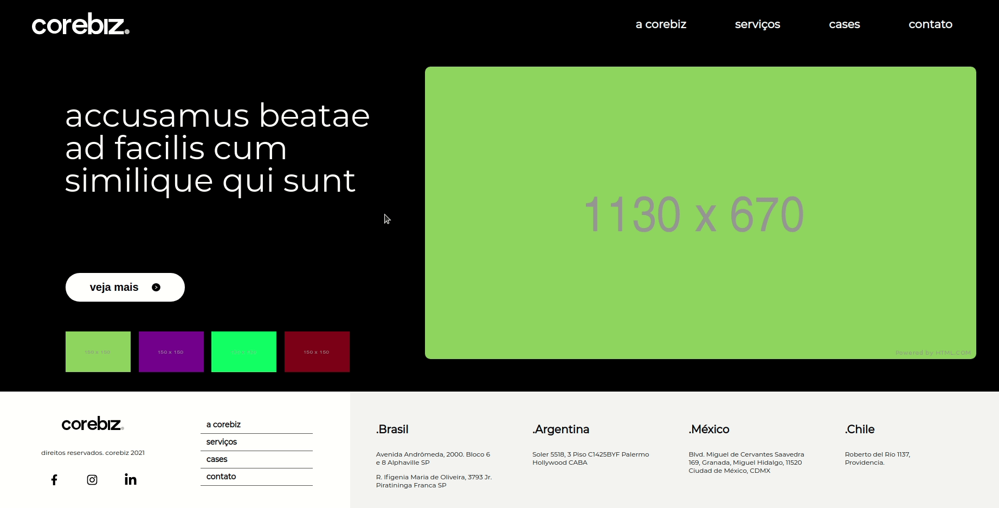
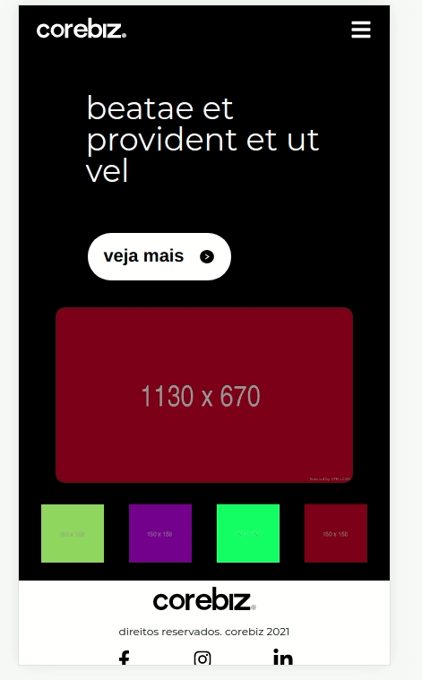
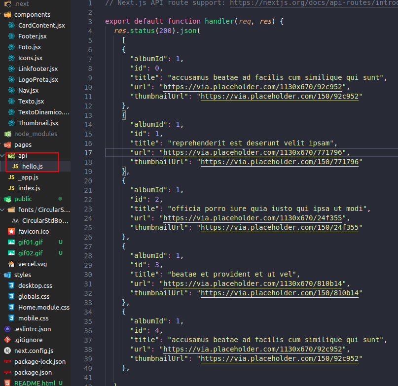
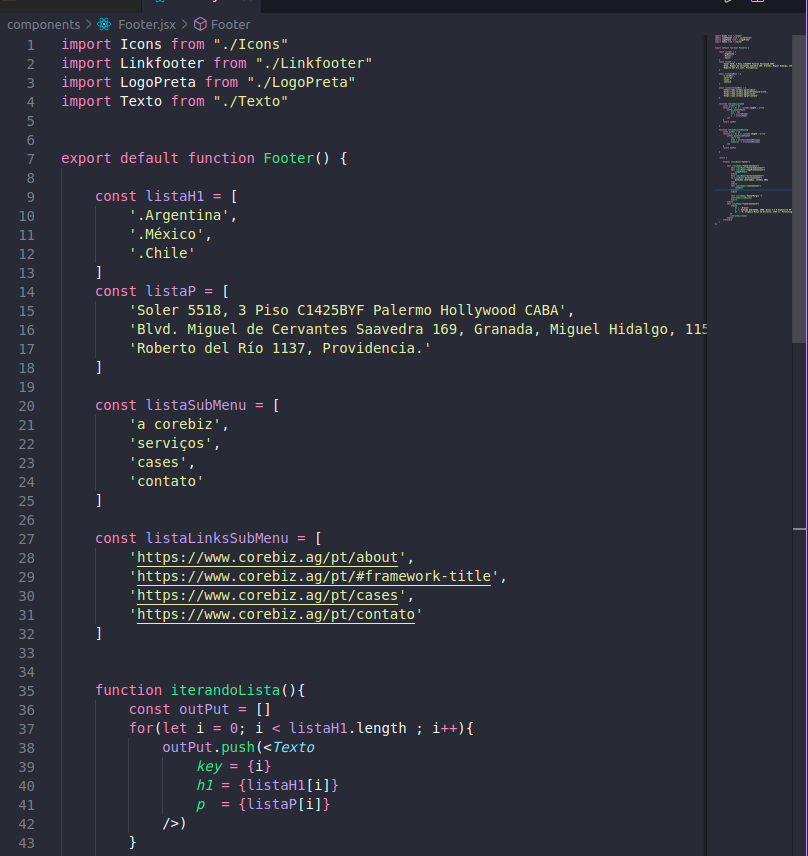
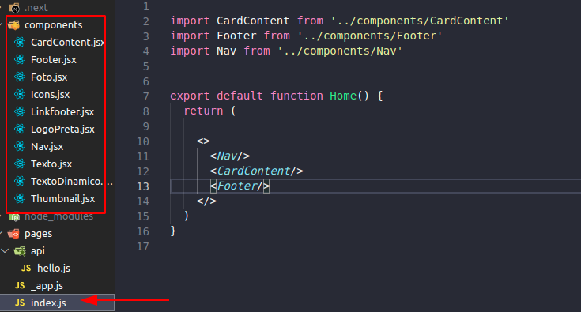
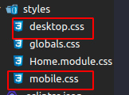
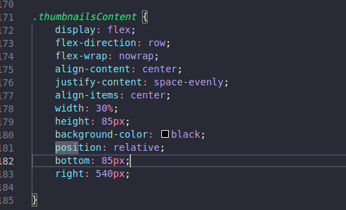
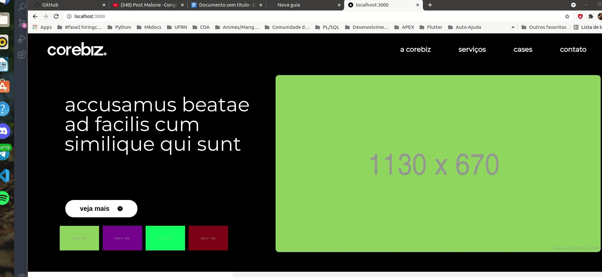

# Desafio Final goBeyond - Corebiz

Este projeto foi feito com muito carinho, usando o framework para React chamado [Next.js](https://nextjs.org/) .  Espero que gostem, e caso tenham sugestões sintam-se à vontade para fazer uma branche desse projeto e contribuir.


## Para rodar o projeto

Requisitos:

- 1. Node.js 12.0 ou posterior
- 2. MacOS, Windows (incluindo WSL) e Linux são suportados

Depois de clonar o projeto, execute no seu terminal.

```bash
npm run dev
# or
yarn dev
```

Abra o link [http://localhost:3000](http://localhost:3000) no seu navegador 


[API routes](https://nextjs.org/docs/api-routes/introduction) pode ser acessada em [http://localhost:3000/api/hello](http://localhost:3000/api/hello). e o endpoint pode ser editado em `pages/api/hello.js`.

ou

Confiram-no no link:  <https://614fe06068c14100080e452b--romantic-meitner-92b362.netlify.app/>

## Instruções do Desafio !


- 1.  Home Page com imagens

Crie uma home page responsiva usando React.

- 2.  Header

O header tem o logo da Corebiz alinhado à esquerda e um menu de navegação horizontal na direita.

- 3.  Main content

O conteúdo principal contém:

- Na coluna da direita, uma imagem grande, dinâmica.
- Na coluna da esquerda, um título dinâmico, seguido por um botão de veja mais que redireciona para o site da Corebiz. Abaixo, uma lista de pequenas imagens dinâmicas que troca o título dinâmico e a imagem grande dinâmica quando clica em cada uma.

- 4.  Footer

O footer contém:

- O logo da Corebiz seguido pelo texto de direitos reservados e os ícones de redes sociais da Corebiz com seus links.
- Um menu de navegação vertical.
- A lista de endereços da Corebiz, separadas em colunas, por países.

_Você pode ver o resultado esperado, abaixo:_

### Desktop

[Ver no Adobe XD](https://xd.adobe.com/view/e100320d-9539-4cd9-9146-e27f75204e69-b453/)


### Mobile

[Ver no Adobe XD](https://xd.adobe.com/view/e100320d-9539-4cd9-9146-e27f75204e69-b453/screen/02609f96-fe10-4a61-b495-782296f4c193)


## Get images

Para pegar as imagens dinâmicas, use essa API: `https://jsonplaceholder.typicode.com`

### Endpoints:

```
  GET /photos
```

### Exemplo de resposta:

```
[
  {
    "albumId": 1,
    "id": 1,
    "title": "accusamus beatae ad facis cum similique qui sut",
    "url": "https://via.placeholder.com/600/92c952",
    "thumbnailUrl": "https://via.placeholder.com/150/92c952"
  },
  {
    "albumId": 1,
    "id": 2,
    "title": "reprehenderit est deserunt velit ipsam",
    "url": "https://via.placeholder.com/600/771796",
    "thumbnailUrl": "https://via.placeholder.com/150/771796"
  }
]
```


## O desenvolvimento

### o resultado 

- 1. Versão Desktop:
- 


- 2. Versão Mobile:
- 


### Componentes

O **foco** do desenvolvimento  criar diversos componentes com objetivo de deixar a implementação do projeto mais performática e fácil de entender.
O desafio foi torná-lo '**dinâmico**'.
Já que para isso os parâmetros como texto e imagens de qualquer aplicação comercial são consumidas por alguma API ou até mesmo um arquivo de configuração e essa experiência me faltava.
 
Com isso em foco tentei consumir minha própria **API** e em outros casos eu consumi algumas informações como links que estavam em **arrays** com o objetivo de criar os componentes dinamicamente e acelerar o meu processo de desenvolvimento.


Foto01: API usada no projeto

___


Foto02: Consumindo arrays no projeto com o intuito de criar components dinamicamente.

___


Foto03: Consumindo os componentes.
___


### Estilo

Foram feitos 2 arquivos de CSS o da versao **Desktop** e o outro da versao **Mobile** no qual foi usado media query para despositivos de até 600px



Foto04: Arquivos CSS


## Eventuais Dificuldades

Existiram diversos problemas durante a implementação mas o que me deu mais trabalho foi em posicionar o componente que contém a **Thumbnail** precisei usar uma a propriedade **POSITION**. Ocasionando um problema de arrasto no componente quando o usuário diminui a dimensão da tela do navegador.




Foto05: Codigo CSS usado na Thumbnail




Foto04: 

